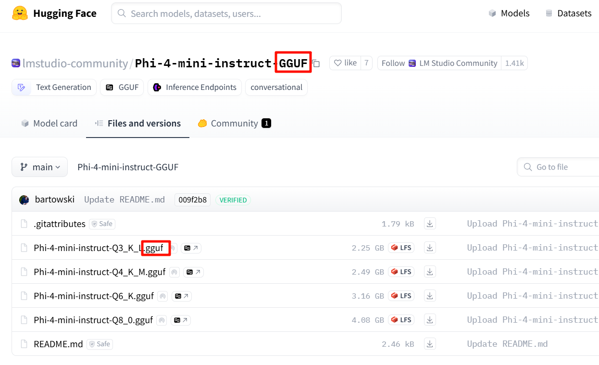
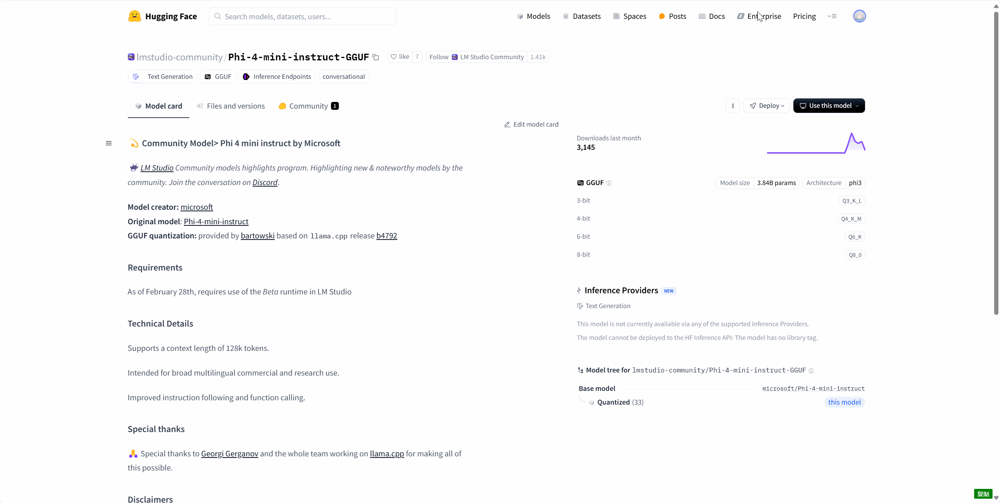
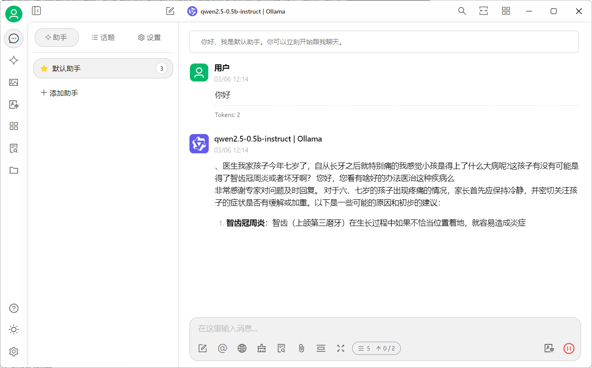

# 部署总结

> 从一个hugging face 链接开始，实现用Cherry Studio测试大模型
> 

## 路径推荐：

如果自己的电脑带得动、有图形界面，那么推荐直接使用 LM Studio（无图形界面则推荐Ollama）。

如果已经在服务器下载了模型，或者说后续在服务器需要跑模型，推荐使用 vLLM 进行部署，SSH 进行转发，在本地前端进行对话。

首先模型主流格式主要有两种选择：

- （主要）Hugging Face主导的安全张量格式SafeTensors
- llama.cpp团队推出的[GGUF](https://huggingface.co/docs/hub/gguf)。

| **​特性** | **​GGUF** | **​Safetensors** |
| --- | --- | --- |
| ​**主要目标** | 高效推理、模型量化、跨平台兼容性 | 安全存储、防止恶意代码执行 |
| ​**适用场景** | CPU/边缘设备推理，量化模型部署 | 安全共享模型，Hugging Face 生态系统 |




> p.s. Hugging Face 的模型可以转换为GGUF：[Tutorial: How to convert HuggingFace model to GGUF format · ggml-org/llama.cpp · Discussion #2948](https://github.com/ggml-org/llama.cpp/discussions/2948)。gguf转safetensors 目前没有较好的方法。
> 

# 加载 Safetensor 模型

最快最方便的方法是直接用代码进行访问，如果希望用UI进行交互，保存历史记录，则需要依靠vLLM Server来进行部署。

## 基于Hugging Face Transformer快速加载

- Code
    
    ```python
    from transformers import AutoModelForCausalLM, AutoTokenizer
    
    model_name = "Qwen/Qwen2.5-0.5B-Instruct"
    
    model = AutoModelForCausalLM.from_pretrained(
        model_name,
        torch_dtype="auto",
        device_map="auto"
    )
    tokenizer = AutoTokenizer.from_pretrained(model_name)
    
    prompt = "Give me a short introduction to large language model."
    messages = [
        {"role": "system", "content": "You are Qwen, created by Alibaba Cloud. You are a helpful assistant."},
        {"role": "user", "content": prompt}
    ]
    text = tokenizer.apply_chat_template(
        messages,
        tokenize=False,
        add_generation_prompt=True
    )
    model_inputs = tokenizer([text], return_tensors="pt").to(model.device)
    
    generated_ids = model.generate(
        **model_inputs,
        max_new_tokens=512
    )
    generated_ids = [
        output_ids[len(input_ids):] for input_ids, output_ids in zip(model_inputs.input_ids, generated_ids)
    ]
    
    response = tokenizer.batch_decode(generated_ids, skip_special_tokens=True)[0]
    
    ```
    

## vLLM

我们可以在Python中借助vLLM进行推理，这能够大大提高推理效率，加快GRPO，evaluation等场景。但这里的重点是Server，因此仅提供一个Quickstart供参考。

- Code
    
    ```python
    from vllm import LLM, SamplingParams
    
    llm = LLM(model="microsoft/Phi-4-mini-instruct", trust_remote_code=True)
    
    messages = [
        {"role": "system", "content": "You are a helpful AI assistant."},
        {"role": "user", "content": "Can you provide ways to eat combinations of bananas and dragonfruits?"},
        {"role": "assistant", "content": "Sure! Here are some ways to eat bananas and dragonfruits together: 1. Banana and dragonfruit smoothie: Blend bananas and dragonfruits together with some milk and honey. 2. Banana and dragonfruit salad: Mix sliced bananas and dragonfruits together with some lemon juice and honey."},
        {"role": "user", "content": "What about solving an 2x + 3 = 7 equation?"},
    ]
    
    sampling_params = SamplingParams(
      max_tokens=500,
      temperature=0.0,
    )
    
    output = llm.chat(messages=messages, sampling_params=sampling_params)
    print(output[0].outputs[0].text)
    
    ```
    

### Server

启动 Server

```python
vllm serve \
    "Qwen/Qwen2.5-0.5B-Instruct" \
    --gpu_memory_utilization=0.1 \
    --download-dir "/data0/models/"
    
```

 常用参数：

```python
--host 和 --port 参数指定地址。
--chat-template 参数指定聊天模板。
--served-model-name 指定模型显示的名称。
--max-model-len 指定模型的最大长度。
```

**注意：**

- 第一个位置参数是模型路径，可以是”Qwen/Qwen2.5-0.5B-Instruct”这种形式，vLLM默认会从hugging face的cache文件夹中读取（可以通过--download-dir指定），没有的话会进行下载。
- vLLM暂不支持同时部署多个大模型，但是可以采用一次部署一个模型，部署多次的方法来实现部署多个大模型，可以通过 `--host` 和 `--port` 参数来自定义地址。
- 设置后台服务并指定 GPU：`CUDA_VISIBLE_DEVICES=0,1,2 nohup {...上述命令} > test.log 2>&1 &`

### 接入 UI

这里基于Cherry Studio和vscode进行演示。

在上述命令运行成功之后，应该会显示（我这里调整了port）：


接下来再开一个终端，用ssh -L连接服务器：

```python
ssh -L [<本地绑定地址>:]<本地端口>:<目标地址>:<目标端口> <用户名>@<远程主机> [-p <SSH端口>]

e.g. ssh -L 8000:localhost:8001 x
```

远程主机的部分也可以是SSH 配置中定义的别名。

连接之后效果如下：


前面的8001是在本机进行访问的端口，后面的8081是vLLM的端口。

接下来用UI进行访问，在Cherry Studio设置中依次填写相关配置：

```python
提供商名称：自定义
API密钥：留空
API地址：http://localhost:8001
模型 ID：Qwen/Qwen2.5-0.5B-Instruct
```

演示如下：


# 加载 GGUF 模型

加载 GGUF 的方法有：

- LM Studio
- Ollama（对Linux命令行友好）
- [MLX-LM](https://qwen.readthedocs.io/zh-cn/latest/run_locally/mlx-lm.html)（LM Studio 已经集成了）
- [llama.cpp](https://qwen.readthedocs.io/zh-cn/latest/run_locally/llama.cpp.html) （Ollama底层调用的就是llama.cpp，速度还比它快，[ref](https://zhuanlan.zhihu.com/p/720489982)）

## LM Studio

支持：Window，macOS，Linux

### 下载模型

LM Studio 内部集成了Hugging Face模型下载的功能（如果显示空白，可在App Setting中打开Use LM Studio's Hugging Face Proxy）


也可以直接在hugging face访问[lmstudio-community](https://huggingface.co/lmstudio-community)中的模型，然后在Use this model处选择 LM Studio：



### 加载模型

**聊天：**


**部署：**


**接入Cherry Studio：**

启动Server后，可以在Cherry Studio进行访问，只需要选中LM Studio，然后添加模型即可，和vLLM Server的原理是完全一样的。


## Ollama

> 参考：[datawhalechina/handy-ollama](https://github.com/datawhalechina/handy-ollama/tree/main)
> 

### 基本用法

> Ollama 下载：https://ollama.com/download
> 
> 
> Ollama 官方主页：[https://ollama.com](https://ollama.com/)
> 
> Ollama 官方 GitHub 源代码仓库：[https://github.com/ollama/ollama/](https://github.com/ollama/ollama)
> 
> 官网提供了一条命令行快速安装的方法。
> 


```
curl -fsSL https://ollama.com/install.sh | sh
```

此命令将自动下载最新版本的 Ollama 并完成安装，以下是 Ollama 使用常见的指令：

```
ollama serve         #启动ollama
ollama create        #从模型文件创建模型
ollama show          #显示模型信息
ollama run           #运行模型
ollama pull          #从注册表中拉取模型
ollama push          #将模型推送到注册表
ollama list          #列出模型
ollama cp            #复制模型
ollama rm            #删除模型
ollama help          #获取有关任何命令的帮助信息
```

- 验证安装完成，在 `Exec` 处输入：

```
ollama -h
```

- 开启并使用 Ollama

### **如果你没有下载 gguf 文件**

> [library (ollama.com)](https://ollama.com/library) 这里是 Ollama 的模型库，搜索你想要的模型，开启新的终端，启动！
> 

```
ollama run llama3
```

> 下载速度取决于你的带宽，下载完毕即可使用✌记得使用 control + D 退出聊天
> 


### **如果你已经有下载好的 gguf 文件：**

创建一个文件Modelfile（叫什么都可以），在第一行填入你的文件地址，

```python
FROM ./qwen2.5-0.5b-instruct-fp16.gguf

TEMPLATE """{{ if .System }}<|im_start|>system
{{ .System }}<|im_end|>{{ end }}<|im_start|>user
{{ .Prompt }}<|im_end|>
<|im_start|>assistant
"""
PARAMETER stop "<|im_start|>"
PARAMETER stop "<|im_end|>"
```

然后在终端运行：

```python
 ollama create qwen2.5-0.5b-instruct -f Modelfile
```

模型的名称是自定义的，后面的Modelfile是创建的文件的名字，效果如下：


### Ollama server

ollama也可以像vLLM那样启动server服务，但不一样的是它启动之后，可以调用多种模型。默认地址是[http://127.0.0.1:11434](http://127.0.0.1:11434/)。

```
ollama serve
```


如果不喜欢在命令行聊天，则可以接入Cherry Studio。

**注意：Modelfile中需要包含template，有一些教程没有，不包含的效果就是completition**：



加上之后就能正常使用：


> p.s. 如果 Ollama 是主力，建议使用 Chatbox 客户端使用 Ollama，因为它能够自动识别有哪些模型，无需手动添加。
> 

### 高级用法

- 使用 Ollama 加载 Safetensor 模型和 Safetensor adapter [[link](https://github.com/ollama/ollama/blob/main/docs/import.md)]
- 使用 Ollama 对模型进行量化
- 使用 ModelFile 对加载模型进行设置
- …

# UI软件

最后在使用模型的时候，需要用一些UI软件（LM Studio自带界面）：

## [Cherry Studio](https://cherry-ai.com/)：

集大成者，支持调用各类LLM的API，直接在软件中使用各类网页大模型，并能打造本地知识库及调用AI生图等功能。


接下来简单介绍Cherry Studio的一些特性：

### 联网搜索

Cherry Studio支持调用[tavily api](https://tavily.com/)进行联网搜索，只需要注册即可享每月500次搜索，效果如下：


### 打造知识库

Cherry Studio 支持对文件、网址、网站等内容，调用 embeddin 模型，打造知识库。此处以本文作为文件为例，对比使用与不使用知识库的效果。


在知识库中检索的效果：


不使用知识库功能：


使用知识库功能：


### 网页模型集合

Cherry Studio 集成了常见的模型，可以很方便地进行调用：


## [Chatbox](https://web.chatboxai.app/)：

有网页端，支持各类模型（包括本地模型），能够快速使用


## [open-webui](https://github.com/open-webui/open-webui)：

可以通过docker快速部署，界面和ChatGPT比较像


- …[What is the best UI for using the API instead of ChatGPT web? : r/ChatGPTPro](https://www.reddit.com/r/ChatGPTPro/comments/17qr7eg/what_is_the_best_ui_for_using_the_api_instead_of/)
